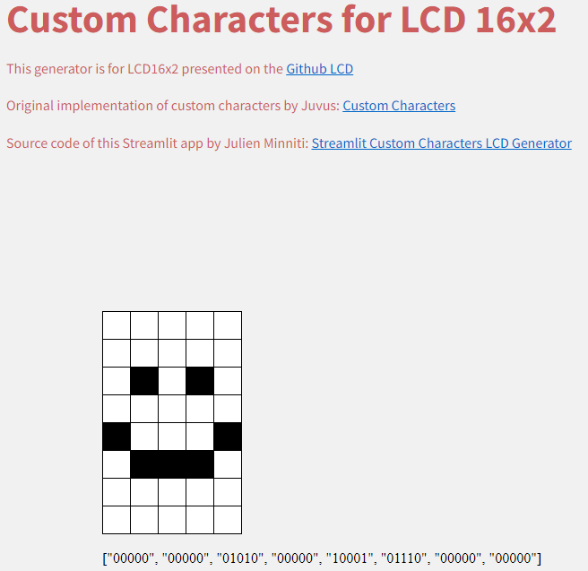

# Custom Characters LCD
Streamlit app to generate custom characters for LCD 16x2

This generator is for LCD16x2 presented on the [Github LCD](https://github.com/the-raspberry-pi-guy/lcd?tab=readme-ov-file#custom-characters)

Original implementation of custom characters by Juvus: [Custom Characters](https://github.com/juvus/lcd)

Streamlit app by Julien Minniti: [Streamlit Custom Characters LCD Generator](https://custom-characters-for-lcd16x2.streamlit.app/)

  

